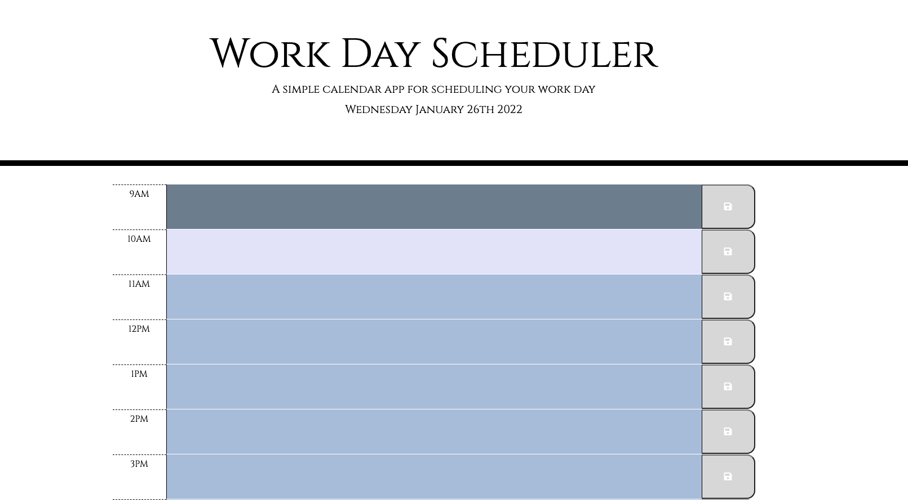

# Work Day Scheduler

## Description
Create a simple calendar application that allow users to save important events to manage time effectively.

## Criteria
- Current date is displayed at top of the calendar
- Presented with timeblocks for standard business hours
- Each timeblock is color coded to indicate whether it is in the past, present or future
- Click on a timeblock to enter an event
- Click on save button to save event for that time block and the event is saved in local storage
- Event still appears when you hit refresh

## Screenshot

## Deployed Page
https://chindatrate.github.io/work-day-scheduler/

## GitHub Repository
https://github.com/chindatrate/work-day-scheduler